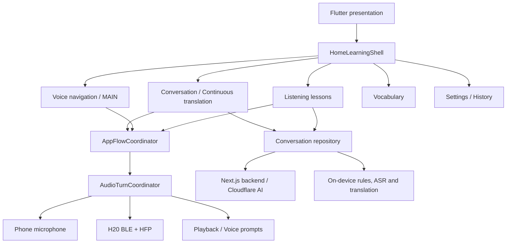

# Báo cáo tổng quan hiện trạng toàn bộ ứng dụng HOMI

> Thời điểm rà soát: 14/09/2026  
> Phạm vi: toàn bộ Flutter client, Android/iOS/Web, nội dung học, luồng AI/âm thanh, thiết bị H20, kiểm thử và khả năng phát hành production  
> Nhánh đang kiểm tra: `codex/audio-session-modularization`  
> Commit nền hiện tại: `d26e5ed` — `update`  
> Trạng thái: đã cập nhật sau khi sửa luồng Bộ từ vựng và rà soát lại composition root

## 1. Kết luận điều hành

Ứng dụng hiện đã có kiến trúc và phạm vi tính năng tương đối đầy đủ cho một sản phẩm học tiếng Anh có trợ lý giọng nói: dịch liên tục, điều hướng bằng giọng nói, học theo chủ đề, luyện nghe/nói, bộ từ vựng, lịch sử, cài đặt phụ huynh, chế độ offline và tích hợp thiết bị H20.

Trạng thái kỹ thuật hiện tại:

- Kiến trúc module: đạt kiểm tra ranh giới phụ thuộc.
- Phân tích tĩnh: `flutter analyze` không có lỗi.
- Test logic/non-golden theo bộ lọc CI: toàn bộ 105 file test đã pass sau thay đổi.
- Toàn bộ test suite: 733 test pass, 19 test fail; phần fail tập trung ở golden UI và timeout `pumpAndSettle`.
- Có sẵn một APK release build, nhưng chưa đủ bằng chứng để khẳng định đó là bản production cuối cùng hoặc đủ điều kiện đưa lên store.
- Luồng thêm từ ở Bộ từ vựng đã được khôi phục ngay trên ô nhập chính và đã có provider gợi ý dựa trên nội dung học theo độ tuổi.
- Rà soát composition sau khi chia module phát hiện thêm dây nối lưu tiến độ onboarding bị thiếu; dây nối này đã được khôi phục và có kiểm tra kiến trúc chống tái diễn.
- Độ trễ dịch Android vẫn chưa có số đo từ đúng thiết bị H20/máy tester để kết luận.
- Kho nội dung đã có quy mô lớn, nhưng metadata âm thanh còn 2.430 mục `PENDING_TTS`, đây là rủi ro phát hành nội dung đáng kể.

Đánh giá ngắn: **codebase buildable, luồng từ vựng vừa được sửa và phần logic lõi khá ổn, nhưng toàn sản phẩm chưa ở trạng thái production-ready**. Các chặn chính còn lại là bộ test UI chưa xanh, nội dung TTS chưa được chốt, ký release Android có đường lui sang debug key, và chưa có biên bản test thiết bị thật đầy đủ.

## 2. Ảnh chụp repository và bản build

| Hạng mục | Hiện trạng |
|---|---|
| Flutter package | `ai_speaking_flutter_app` |
| Phiên bản khai báo | `1.0.5+7` |
| Dart SDK | `>=3.8.0 <4.0.0` |
| Kiến trúc | Modular monolith theo feature |
| Mã Dart trong `lib/` | 180 file |
| Test Dart | 111 file, khoảng 750 khai báo test |
| Assets | 296 file |
| Nền tảng | Android, iOS, Web/PWA |
| Android package | `com.innotrik.aispeaking` |
| Android tối thiểu | API 24 |
| APK tìm thấy | `build/app/outputs/flutter-apk/app-release.apk` |
| Kích thước APK | 167.642.536 byte, khoảng 159,9 MiB |
| SHA-256 APK | `F0567B620811F31B6CF3A8700EA998314F346659350B3F90E25EBABD10C86196` |

Lưu ý về APK:

- File APK trên được tạo lúc 23:01:44 ngày 13/09/2026.
- Repository hiện có thay đổi chưa commit, do đó chưa thể mặc định rằng APK này chứa đúng toàn bộ trạng thái code hiện tại.
- Cấu hình Android cho phép release fallback sang debug signing khi thiếu `key.properties`. Cơ chế này tiện cho build nội bộ nhưng không phù hợp để xác nhận một bản phát hành store chính thức.

## 3. Bản đồ chức năng toàn ứng dụng

### 3.1 Khởi động và thiết lập ban đầu

Luồng thiết lập ban đầu bao gồm:

1. Đồng ý quyền riêng tư/phụ huynh.
2. Thiết lập hồ sơ, độ tuổi của trẻ.
3. Xin các quyền cần thiết như microphone và Bluetooth.
4. Kết nối hoặc kiểm tra thiết bị H20 nếu sử dụng.
5. Có thể chuẩn bị model nhận dạng/biên dịch offline qua Wi-Fi.

Ứng dụng có lưu tiến độ onboarding và hỗ trợ chế độ giới hạn khi chưa hoàn tất đồng ý cần thiết.

### 3.2 Màn hình chính và điều hướng

`HomeLearningShell` là điểm ghép chính của các feature. Từ đây người dùng có thể:

- Bắt đầu dịch liên tục.
- Vào học theo chủ đề.
- Vào bộ từ vựng và bài luyện hôm nay.
- Mở lịch sử.
- Mở cài đặt.
- Dùng nút MAIN/trợ lý giọng nói để ra lệnh và chuyển giữa các khu vực.

Điều hướng bằng giọng nói có hỗ trợ tiếp tục hội thoại theo ngữ cảnh như hỏi độ tuổi, số chủ đề, số bài, chuyển bài trước/sau, tạm dừng, tiếp tục và thoát bài.

### 3.3 Dịch liên tục

Luồng chính là:

```text
Micro/H20
  -> nhận dạng giọng nói
  -> chuẩn hóa transcript
  -> rule/cache cục bộ nếu khớp
  -> backend /api/conversation
  -> dịch + chuẩn bị TTS
  -> phát âm thanh + lưu lịch sử/telemetry
```

Trạng thái UI chính gồm `idle`, `recording`, `processing`, `ready`, `error`; giai đoạn xử lý được chia thành nhận dạng, dịch và chuẩn bị âm thanh.

Ứng dụng có VAD thích ứng, phát hiện im lặng và fallback offline. Backend Next.js giữ API key, prompt, rule, cache, history và telemetry; khóa AI không được thiết kế để đóng gói trực tiếp trong APK.

### 3.4 Trợ lý MAIN và điều khiển bằng giọng nói

Feature `voice_navigation` phụ trách:

- Wake phrase/nút MAIN.
- Nghe lệnh và phân giải ý định.
- Mở tính năng học/dịch/từ vựng.
- Điều khiển bài học đang chạy.
- Phối hợp việc nhường microphone giữa trợ lý, dịch liên tục và bài học.
- Phát prompt qua loa điện thoại hoặc route H20 phù hợp.

Phần này có test tương đối dày cho Android, iOS, HFP, timeout, fallback transcript và điều khiển bài học.

### 3.5 Học theo chủ đề, nghe và nói

Module `listening` là module lớn nhất của ứng dụng. Luồng nội dung bao gồm:

- Danh sách/chặng chủ đề.
- Giới thiệu bài.
- Tổng quan bài học.
- Luyện từng câu.
- Thử thách nghe/nói.
- Hội thoại role-play.
- Nhiệm vụ.
- Karaoke/bài hát.
- Màn hình tổng kết, sao và ôn lại.

Tiến độ được lưu cục bộ; bài và câu có thứ tự mở khóa. Hệ thống đánh giá ưu tiên backend và có fallback offline phù hợp cho một số trường hợp.

### 3.6 Bộ từ vựng

Module từ vựng hiện có:

- Danh sách từ đã lưu.
- Tìm kiếm/lọc từ và thêm trực tiếp từ cùng ô nhập.
- Thêm từ qua nút `+` và hộp thoại riêng.
- Đề xuất từ/dịch từ catalog nội dung đã biên soạn, chọn theo nhóm tuổi của trẻ.
- Bài luyện hằng ngày và luồng ôn tập.

Thay đổi đã thực hiện trên worktree hiện tại:

- Khi gõ nội dung, ô nhập hiện CTA `Đề xuất để thêm từ này`.
- Nhấn CTA hoặc phím hoàn tất trên bàn phím sẽ đi thẳng vào luồng dịch, chọn đề xuất và lưu từ.
- Nút `+` cũ vẫn được giữ và dùng chung một luồng xử lý, tránh hai hành vi khác nhau.
- `HomeLearningShell` luôn có provider production mặc định lấy từ/câu đã duyệt trong nội dung học theo độ tuổi; provider inject từ ngoài vẫn được ưu tiên khi có.
- Có widget test cho hành trình gõ `con mèo` → thấy đề xuất → chọn → lưu → xóa nội dung ô nhập.

Kiểm tra trực tiếp trên Android emulator API 36 đã xác nhận ô nhập hiển thị đúng CTA thêm từ khi gõ. Hộp đề xuất và thao tác lưu hoàn chỉnh đã được xác nhận bằng widget test; vẫn cần smoke test lại trên đúng máy Android/H20 của người kiểm thử trước khi phát hành.

Chi tiết điều tra riêng: [Báo cáo Android và từ vựng](./bao-cao-hien-trang-android-tu-vung-2026-09-14.md).

### 3.7 Lịch sử, cài đặt và quyền phụ huynh

Ứng dụng có:

- Lịch sử dịch/hội thoại.
- Chọn và lưu độ tuổi.
- Cài đặt âm thanh, dữ liệu, thiết bị H20 và model offline.
- Cổng xác thực phụ huynh bằng `local_auth` ở các luồng cần bảo vệ.
- Thông tin phiên bản và kiểm tra cập nhật.

Cần kiểm tra lại tính nhất quán chính sách cổng phụ huynh giữa Android, iOS và Web vì một số đường dẫn Android cho phép mở trực tiếp khi không được inject gate.

### 3.8 Chạy nền và thiết bị H20

Android có foreground service và companion-device service để duy trì tín hiệu thiết bị khi màn hình khóa/che. Service không tự ý mở microphone; nó giữ sự kiện MAIN đã xác thực và phối hợp route BLE/HFP với Flutter.

Phần native hiện có các bridge cho:

- Android SpeechRecognizer.
- Apple Speech trên iOS.
- BLE/AIV0 và H20.
- HFP/audio session.
- Offline speech/model.
- Background service.
- Opus decoding.
- Credential storage và voice prompts.

## 4. Kiến trúc kỹ thuật

Ứng dụng đang theo modular monolith. Mỗi feature giữ state machine riêng, còn tài nguyên dùng chung như microphone, recognizer, playback và HFP được điều phối tập trung.



Các nguyên tắc kiến trúc đã được tự động kiểm tra:

- `core` không phụ thuộc ngược vào feature.
- Domain/application/data không phụ thuộc presentation.
- Presentation không gọi trực tiếp `MethodChannel`/`EventChannel`.
- Các feature nghe, từ vựng và voice navigation không phụ thuộc UI hội thoại.
- `HomeLearningShell` là nơi composition chính giữa feature.
- Settings/history giao tiếp qua port hẹp thay vì kéo cả feature vào nhau.
- Composition checker hiện kiểm tra thêm các dây nối production quan trọng từ `AiSpeakingApp` vào `HomeLearningShell`, gồm onboarding, privacy, điều hướng MAIN, modal và lựa chọn giọng nói từ vựng.
- Có kiểm tra riêng để bảo đảm fallback provider từ vựng không bị rơi về `null` sau một lần tái cấu trúc khác.

Kết quả `dart run tool/check_architecture_boundaries.dart`: **OK**.

Trong đợt rà soát này, dây nối `SharedPreferencesOnboardingProgressStore` từng có ở composition root nhưng bị mất sau thay đổi cấu trúc đã được khôi phục. Kiểm tra Android xác nhận hướng dẫn lần đầu xuất hiện và có thể bỏ qua/ghi nhớ đúng.

## 5. Ma trận nền tảng

| Nền tảng | Năng lực chính | Hiện trạng/rủi ro |
|---|---|---|
| Android | SpeechRecognizer, HFP/BLE H20, Vosk offline, foreground service, update APK | Luồng chính đầy đủ; cần đo latency máy thật, ký release thật và regression trên nhiều hãng máy |
| iOS | Apple Speech, HFP/BLE, audio background, Face ID/Touch ID, TestFlight workflow | Có bridge và Codemagic workflow; vẫn cần test thiết bị thật và xác nhận quyền/background behavior |
| Web/PWA | Cài đặt PWA, update gate, web recorder, Batch upload thích ứng | Có short direct upload và long chunk upload; Bluetooth/mic phụ thuộc trình duyệt và cần kiểm thử tương thích |

## 6. Trạng thái AI, ASR và âm thanh

### 6.1 Android hiện dùng gì trong dịch liên tục?

Với cấu hình production hiện tại:

- `USE_DEMO_BACKEND=false`
- `PREFER_BLE_STREAMING=true`
- `ENABLE_LEGACY_BLE_AUDIO=false`
- `ENABLE_HFP_AUDIO=true`
- `REALTIME_BATCH_FALLBACK=true`

Đường chính trên Android khi dùng mic điện thoại hoặc H20 qua HFP là **Android `SpeechRecognizer` dạng streaming trực tiếp**. Không phải mọi lượt nói đều đi Cloudflare Batch Chunks.

Cloudflare Batch Chunks là đường fallback hoặc đường chuyên biệt trong các trường hợp như legacy BLE, không có ASR offline phù hợp, Realtime hỏng, hoặc phải xử lý audio đã ghi.

Sau khi ASR chốt transcript, backend vẫn cần thực hiện dịch/chuẩn bị TTS. Vì vậy người dùng có thể cảm nhận tổng thời gian lâu dù nhận dạng giọng nói không dùng Batch.

### 6.2 Phản ánh chậm khoảng 4 giây

Code Android có khoảng chờ chốt SpeechRecognizer sau khi dừng:

- Khoảng 220 ms nếu đã có partial ổn định.
- Nếu chưa ổn định: 500 ms rồi tối đa thêm khoảng 700 ms.

Không thấy một timer cố định 4 giây trong luồng dịch; mốc 4 giây tìm thấy thuộc kiểm tra microphone H20, không phải timeout translate.

Do đó chưa đủ bằng chứng để kết luận “4 giây là do Cloudflare Batch”. Cần thu telemetry theo từng lượt trên thiết bị tester:

- `asrFinalAfterStopMs`
- thời gian request backend
- thời gian chuẩn bị TTS/audio
- `audioStartedAfterStopMs`
- loại input/ASR thực tế và việc có chạy fallback hay không

## 7. Kho nội dung học

`assets/data/listening_lessons.json` hiện có:

| Nhóm tuổi | Định hướng | Cấp độ | Chủ đề | Bài học | Câu | Nhiệm vụ |
|---|---|---:|---:|---:|---:|---:|
| 3–5 | Làm quen tiếng Anh | 3 | 10 | 21 | 119 | 36 |
| 6–7 | Nền tảng giao tiếp | 3 | 10 | 22 | 132 | 36 |
| 8–10 | Giao tiếp tình huống | 3 | 10 | 22 | 110 | 36 |
| 11–12 | Tư duy và ứng dụng | 3 | 10 | 24 | 120 | 36 |
| 13–15 | Giao tiếp độc lập | 3 | 10 | 20 | 120 | 36 |
| **Tổng** | **5 nhóm tuổi** | **15** | **50** | **109** | **601** | **180** |

Lexicon AI có 622 mục, gồm 601 câu mục tiêu lõi và 21 lượt thoại trẻ em trong role-play.

Rủi ro nội dung lớn nhất là manifest âm thanh V4:

- Tổng 2.435 mục.
- 5 mục `READY_SOURCE_AUDIO`.
- 2.430 mục `PENDING_TTS`.

Điều này không đồng nghĩa toàn app chắc chắn không phát được tiếng vì vẫn có TTS/provider/cache/fallback, nhưng metadata nội dung chưa thể hiện trạng thái production hoàn tất. Cần reconcile manifest với file thật/CDN/cache và chốt tiêu chí “READY” trước phát hành.

## 8. Bảo mật, quyền riêng tư và vận hành backend

Điểm đang có:

- Không thiết kế để nhúng API key nhà cung cấp AI vào APK.
- Android release tắt cleartext traffic.
- Có parent consent và chế độ giới hạn.
- Credential cài đặt sử dụng secret ngẫu nhiên, access/refresh token và kho native an toàn: Android Keystore/iOS Keychain; Web dùng storage theo origin.
- Có phân tầng backend cho prompt, cache, telemetry, history và báo cáo.
- Có update gate theo build tối thiểu/phiên bản mới nhất trên Android và cơ chế cập nhật PWA.

Các việc backend cần xác nhận trước production:

- Rate limit dùng storage dùng chung thay vì chỉ dựa vào bộ nhớ từng instance.
- Hạn chế quyền cho admin/report endpoint.
- TTL và cleanup cho history, cache và telemetry.
- Chính sách log không lộ transcript/audio nhạy cảm ngoài nhu cầu vận hành.
- Durable storage và backup/retention.
- Cache/range cho TTS/audio và health/version endpoint.
- Warm-up và chống lạm dụng endpoint tốn chi phí AI.

## 9. Kết quả kiểm thử tại thời điểm báo cáo

| Kiểm tra | Kết quả |
|---|---|
| Architecture boundary checker | Pass |
| `flutter analyze` | Pass, không có issue |
| Test logic/non-golden theo bộ lọc CI | Pass toàn bộ 105 file sau thay đổi |
| `flutter test` toàn suite | 733 pass, 19 fail |
| Test trọng điểm kiến trúc, Home và từ vựng | 29 test pass |
| Build/cài Android debug | Pass trên Pixel 8 emulator, Android API 36 |
| Test Android ASR đường chính | Pass |
| Test BLE → Batch fallback | Pass |

Nhóm 19 lỗi của full suite gồm:

- Golden image lệch pixel ở home, vocabulary, listening, conversation, karaoke và settings.
- Một số `pumpAndSettle` timeout trong trạng thái recording/processing hoặc màn hình có animation/audio giả lập.
- Có golden lệch rất nhỏ khoảng 0,01–1,56%, nhưng cũng có trường hợp review lệch lớn khoảng 80,97%; không nên cập nhật golden hàng loạt trước khi xác minh đó là thay đổi UI chủ đích.

Diễn giải: logic lõi theo bộ lọc CI hiện xanh, nhưng snapshot UI và độ ổn định widget test chưa xanh. Đây vẫn là release risk vì có thể che giấu regression bố cục thật, đặc biệt trên màn hình Android nhỏ như ảnh tester cung cấp.

## 10. Các vấn đề và rủi ro hiện tại

| Mức | Vấn đề | Tác động | Hướng xử lý |
|---|---|---|---|
| P0 | 2.430 audio manifest còn `PENDING_TTS` | Không xác nhận được độ phủ audio production | Đối soát manifest–asset–CDN và hoàn tất pipeline nội dung |
| P0 | Release Android có thể fallback debug signing | APK có tên release nhưng không bảo đảm ký production | Bắt buộc fail build production nếu thiếu keystore chính thức |
| Đã xử lý | Luồng nhập thêm từ bị biến thành trải nghiệm tìm kiếm | Đã có CTA thêm từ ngay trong ô nhập và provider theo độ tuổi | Smoke test lại trên máy Android/H20 thật và backend release |
| P1 | Tester báo translate Android khoảng 4 giây | Trải nghiệm hội thoại chậm | Thu telemetry từng chặng trên đúng máy/H20/mạng; tối ưu sau khi xác định bottleneck |
| P1 | 19 test UI/golden đang fail | Không có baseline UI đáng tin cậy | Phân loại thay đổi chủ đích, sửa timeout, chỉ regenerate golden đã duyệt |
| P1 | Chưa có biên bản test phần cứng đầy đủ | BLE/HFP/background có thể khác theo thiết bị | Test ma trận máy Android/iPhone và firmware H20 thật |
| P1 | Worktree có thay đổi sửa từ vựng/onboarding chưa commit | APK release cũ chưa chứa bản sửa mới | Review, commit và build lại từ commit sạch |
| P2 | APK khoảng 159,9 MiB | Tải/cập nhật nặng | Phân tích size, tách ABI/app bundle, rà model/audio bundled |
| P2 | 37 package có bản mới không tương thích constraint | Tăng nợ bảo trì/bảo mật theo thời gian | Lập đợt nâng dependency riêng và chạy regression |
| P2 | README có phần mô tả thương hiệu “Himi” không liên quan ở cuối | Gây lẫn scope/tài liệu sản phẩm | Tách hoặc xóa phần tài liệu không thuộc HOMI |
| P2 | Chính sách parental gate có thể khác nhau giữa platform | Trải nghiệm/quyền truy cập không nhất quán | Chốt policy sản phẩm và thêm integration test đa nền tảng |

## 11. Ma trận sẵn sàng production

| Khu vực | Trạng thái | Nhận định |
|---|---|---|
| Kiến trúc module | Xanh | Boundary checker pass, trách nhiệm feature rõ |
| Phân tích tĩnh | Xanh | `flutter analyze` sạch |
| Logic/unit/widget không golden | Xanh | 105 file theo bộ lọc CI pass |
| UI regression/golden | Đỏ | 19 lỗi trong full suite cần xử lý |
| Android functional | Vàng | Có build và native integration; thiếu xác nhận latency/máy thật/signing |
| iOS functional | Vàng | Có bridge/workflow; thiếu biên bản thiết bị thật và bản TestFlight xác nhận |
| Web/PWA | Vàng | Có install/update/batch flow; cần browser compatibility test |
| Nội dung học | Đỏ | Quy mô tốt nhưng metadata TTS phần lớn còn pending |
| Backend vận hành | Vàng | Thiết kế đúng hướng; cần xác nhận hardening và quan sát production |
| H20/BLE/HFP | Đỏ | Nhiều test tự động nhưng chưa thay thế được ma trận phần cứng thật |
| Privacy/auth | Vàng | Có consent và secure credential; cần audit retention/log/policy đa nền tảng |
| Phát hành store | Đỏ | Chưa chốt signing, test UI, content và provenance của APK |

## 12. Kế hoạch ưu tiên đề xuất

### Giai đoạn 1 — Chốt các blocker phát hành

1. Hoàn tất review/commit bản sửa Bộ từ vựng và onboarding hiện tại.
2. Bổ sung đo latency Android, tái hiện phản ánh 4 giây trên đúng thiết bị và mạng.
3. Phân loại/sửa 19 test fail; không regenerate golden mù.
4. Đối soát 2.430 mục `PENDING_TTS` và xác nhận độ phủ audio thật.
5. Bắt buộc production keystore; build lại APK/AAB từ commit sạch.

### Giai đoạn 2 — Xác minh tích hợp thực tế

1. Test Android theo ít nhất một máy Samsung, Pixel/AOSP và một hãng tùy biến mạnh; gồm mic điện thoại và H20.
2. Test iPhone thật cho Apple Speech, HFP, Bluetooth central, background/foreground và quyền.
3. Test H20 scan/connect/reconnect, MAIN khi khóa màn hình, A2DP/HFP, BLE events, firmware và Opus.
4. Chạy end-to-end với backend staging/production-like, mạng chậm, mất mạng và token refresh.

### Giai đoạn 3 — Tối ưu và phát hành

1. Giảm kích thước bản phân phối bằng AAB/ABI split và rà tài nguyên/model.
2. Kiểm tra accessibility, font 200%, màn hình nhỏ, dark mode và bàn phím Android.
3. Chốt privacy retention, observability dashboard và cảnh báo lỗi/latency.
4. Tạo release candidate có tag/commit/hash rõ ràng, ký chính thức và smoke test lại trước khi phân phối.

## 13. Tiêu chí để gọi là “production-ready”

Chỉ nên phát hành rộng khi tối thiểu đạt các điều kiện sau:

- Full test suite xanh hoặc mọi exception được duyệt và ghi rõ.
- Luồng thêm từ và đề xuất từ hoạt động trên root production app và đã được smoke test trên thiết bị thật.
- P50/P95 latency dịch Android được đo; không còn hồi quy rõ rệt so với nhánh trước.
- Manifest nội dung khớp tài nguyên/CDN và không còn audio bắt buộc ở trạng thái chưa hoàn tất.
- APK/AAB được ký bằng production key, tạo từ commit sạch và lưu SHA-256.
- Test thiết bị thật Android/iOS/H20 hoàn tất với biên bản pass/fail.
- Backend production có rate limit, quyền admin, retention, logging an toàn và health monitoring.
- Có release notes, rollback plan và version gate đúng với build phát hành.

## 14. Tài liệu liên quan

- Báo cáo điều tra chi tiết hai phản ánh Android/từ vựng: [bao-cao-hien-trang-android-tu-vung-2026-09-14.md](./bao-cao-hien-trang-android-tu-vung-2026-09-14.md)
- Kiến trúc repository: [architecture.md](./architecture.md)
- Hướng dẫn và mô tả sản phẩm: [README.md](../README.md)

---

**Kết luận cuối:** ứng dụng đã vượt giai đoạn prototype và có nền kỹ thuật tốt. Lỗi luồng thêm từ cùng một dây nối onboarding bị thiếu sau tái cấu trúc đã được xử lý trên worktree hiện tại. Bản build hiện tại vẫn nên được xem là **release candidate nội bộ** cho đến khi xử lý latency có đo đạc, test UI, nội dung TTS, signing và kiểm thử thiết bị thật.
