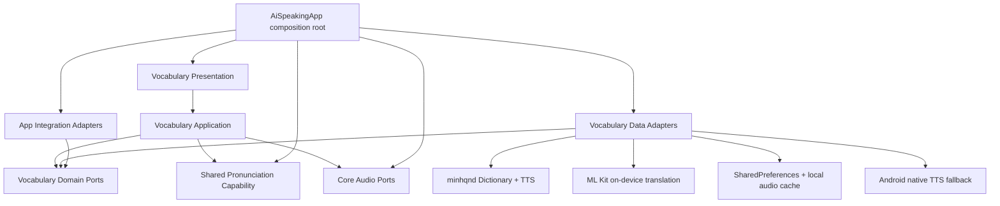
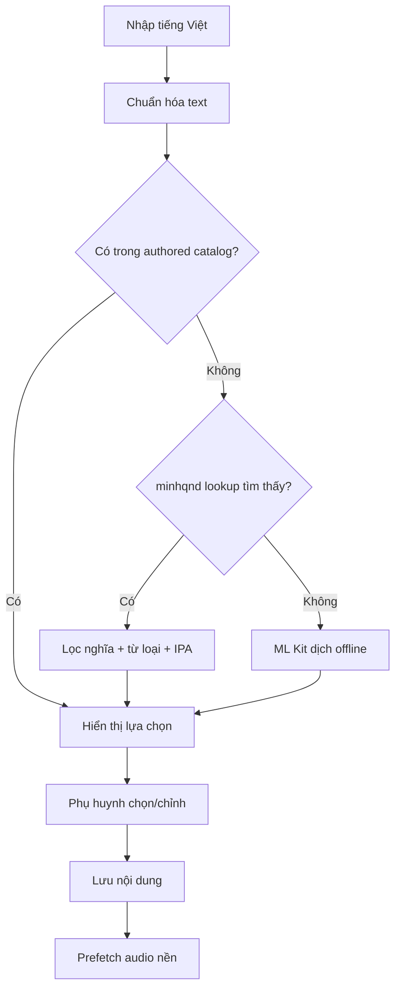
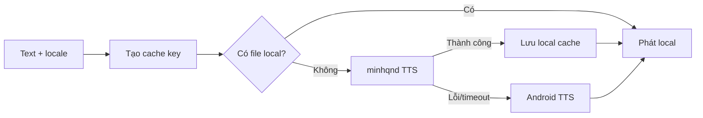
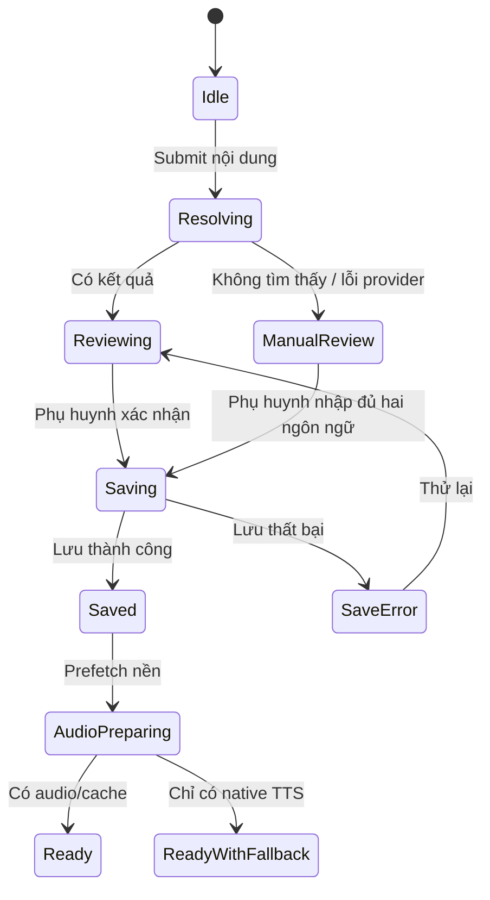

# Kiến trúc sắp tới cho Bộ từ vựng HOMI

> Trạng thái: đề xuất kiến trúc, chưa phải mô tả code đã triển khai hoàn tất  
> Ngày lập: 14/09/2026  
> Phạm vi: thêm từ, cụm từ, câu; đề xuất câu mẫu; phát âm; luyện nói; lưu tiến độ  
> Mục tiêu chi phí: mặc định không sử dụng LLM trả phí và không phát sinh token AI

## 1. Kết luận kiến trúc

Bộ từ vựng tiếp tục nằm trong **modular monolith theo feature**, nhưng phải trở
thành một module có contract riêng. UI Bộ từ vựng không được gọi trực tiếp API,
ML Kit, Android TTS hoặc implementation thuộc module Luyện nghe.

Kiến trúc đích:



Nguyên tắc chính là **dependency inversion**:

- Domain định nghĩa app cần khả năng gì.
- Data cung cấp cách thực hiện khả năng đó.
- Application điều phối use case.
- Presentation chỉ hiển thị state và gửi intent người dùng.
- Composition root là nơi duy nhất ghép implementation thật vào contract.

## 2. Mục tiêu

1. Phụ huynh có thể thêm từ, cụm từ hoặc câu.
2. Nội dung tiếng Việt có thể được đề xuất bản tiếng Anh mà không dùng LLM trả
   phí trong luồng mặc định.
3. Một từ có thể sinh 3-5 câu mẫu đúng ngữ pháp bằng rule/template cục bộ.
4. Phụ huynh luôn được chọn hoặc sửa nghĩa và câu trước khi lưu.
5. Audio được tải/tạo một lần rồi cache trên máy.
6. Khi dịch vụ bên ngoài lỗi, người dùng vẫn học được bằng Android TTS.
7. Sửa Bộ từ vựng không làm thay đổi Dịch liên tục hoặc Luyện nghe.
8. Dữ liệu cũ được migration an toàn, không xóa tiến độ hoặc bản ghi của trẻ.

## 3. Ngoài phạm vi

Đợt kiến trúc này không chủ động thay đổi:

- Pipeline Dịch liên tục.
- Cloudflare Batch Chunks hoặc Android SpeechRecognizer của Dịch liên tục.
- Nội dung bài học authored hiện có.
- Giao thức BLE/HFP/H20.
- Chính sách tài khoản, installation authentication hoặc backend history.
- Thuật toán điều hướng MAIN ngoài các contract cần thiết để điều khiển Bộ từ
  vựng.

## 4. Vấn đề của cấu trúc hiện tại

Hiện tại module đã có các lớp `domain`, `data`, `presentation`, nhưng ranh giới
chưa hoàn toàn độc lập:

- `VocabularyHomeScreen` đang xử lý đồng thời UI, tìm kiếm, thêm nội dung, dịch,
  đề xuất, phát audio, session và lệnh MAIN.
- Vocabulary đang import `LessonMediaService`, `LessonAttemptEvaluator` và
  `LessonGuideFlow` của Listening.
- Listening đang import `VocabularyStore` và `VocabularyEntry` để lưu nội dung
  học được.
- `VocabularyEntry` chỉ có tên trường `word` và `meaning`, không diễn tả rõ cụm
  từ/câu và audio prompt.
- `VocabularyStore` và `VocabularySessionStore` đang gắn trực tiếp với
  `SharedPreferences`.
- App root và Home shell phải nối nhiều callback bằng tay; thiếu một dây nối có
  thể làm tính năng production âm thầm mất capability.

Vì vậy, cấu trúc mới phải phá vòng phụ thuộc Vocabulary ↔ Listening trước khi
thêm nhiều logic mới.

## 5. Cấu trúc thư mục đích

```text
lib/
├── app/
│   ├── ai_speaking_app.dart
│   └── integrations/
│       ├── authored_vocabulary_suggestion_adapter.dart
│       └── vocabulary_learning_sink_adapter.dart
│
├── core/
│   ├── audio/
│   │   ├── audio_playback_service.dart
│   │   ├── audio_turn_coordinator.dart
│   │   ├── learning_media_port.dart
│   │   └── voice_prompt_service.dart
│   ├── network/
│   └── storage/
│
├── features/
│   ├── pronunciation/
│   │   ├── domain/
│   │   │   ├── pronunciation_evaluator.dart
│   │   │   └── pronunciation_result.dart
│   │   └── data/
│   │       ├── backend_pronunciation_evaluator.dart
│   │       └── on_device_pronunciation_evaluator.dart
│   │
│   ├── vocabulary/
│   │   ├── domain/
│   │   │   ├── vocabulary_learning_item.dart
│   │   │   ├── vocabulary_repository.dart
│   │   │   ├── vocabulary_session_repository.dart
│   │   │   ├── dictionary_provider.dart
│   │   │   ├── translation_provider.dart
│   │   │   ├── sentence_suggestion_provider.dart
│   │   │   ├── vocabulary_audio_provider.dart
│   │   │   └── vocabulary_policies.dart
│   │   │
│   │   ├── application/
│   │   │   ├── add_learning_item_use_case.dart
│   │   │   ├── resolve_learning_content_use_case.dart
│   │   │   ├── suggest_example_sentences_use_case.dart
│   │   │   ├── prepare_vocabulary_audio_use_case.dart
│   │   │   ├── run_vocabulary_practice_use_case.dart
│   │   │   └── vocabulary_controller.dart
│   │   │
│   │   ├── data/
│   │   │   ├── minhqnd_dictionary_provider.dart
│   │   │   ├── minhqnd_tts_provider.dart
│   │   │   ├── mlkit_translation_provider.dart
│   │   │   ├── rule_based_sentence_suggestion_provider.dart
│   │   │   ├── shared_preferences_vocabulary_repository.dart
│   │   │   ├── shared_preferences_vocabulary_session_repository.dart
│   │   │   └── local_vocabulary_audio_cache.dart
│   │   │
│   │   └── presentation/
│   │       ├── screens/
│   │       │   ├── vocabulary_home_screen.dart
│   │       │   └── vocabulary_practice_screen.dart
│   │       ├── dialogs/
│   │       │   ├── add_learning_item_dialog.dart
│   │       │   └── learning_content_review_dialog.dart
│   │       └── widgets/
│   │           ├── vocabulary_search_field.dart
│   │           ├── vocabulary_collection_view.dart
│   │           ├── sentence_suggestion_list.dart
│   │           └── vocabulary_playback_controls.dart
│   │
│   ├── listening/
│   ├── conversation/
│   └── voice_navigation/
│
└── main.dart
```

Tên file có thể được điều chỉnh trong lúc triển khai, nhưng ranh giới trách
nhiệm không được gộp trở lại vào một screen lớn.

## 6. Luật phụ thuộc bắt buộc

### 6.1. Luật chung

```text
presentation → application → domain
data ----------------------→ domain
app/integrations ----------→ domain của nhiều feature
```

Không cho phép:

```text
domain → application/data/presentation/app
application → presentation
data → presentation
vocabulary → listening implementation
listening → vocabulary data implementation
presentation → MethodChannel/EventChannel/http/SharedPreferences
```

### 6.2. Quy tắc tích hợp Vocabulary và Listening

Listening không gọi `VocabularyStore` trực tiếp. Listening chỉ phát sự kiện hoặc
gọi contract `LearnedContentSink`:

```dart
abstract interface class LearnedContentSink {
  Future<void> saveLearnedSentence(LearnedSentence sentence);
}
```

Adapter tại `app/integrations` chuyển `LearnedSentence` thành
`VocabularyLearningItem` rồi gọi `VocabularyRepository`.

Vocabulary không dùng `LessonMediaService` hoặc `LessonAttemptEvaluator`. Hai
khả năng dùng chung được chuyển thành:

- `LearningMediaPort` trong `core/audio`.
- `PronunciationEvaluator` trong capability `features/pronunciation`.

Nhờ đó dependency graph không còn vòng Vocabulary ↔ Listening.

## 7. Domain model mới

### 7.1. Loại nội dung

```dart
enum LearningItemKind {
  word,
  phrase,
  sentence,
}
```

### 7.2. Nội dung học

```dart
class VocabularyLearningItem {
  const VocabularyLearningItem({
    required this.id,
    required this.kind,
    required this.englishText,
    required this.vietnameseText,
    required this.source,
    required this.status,
    required this.addedAt,
    this.partOfSpeech,
    this.ipa,
    this.examples = const <VocabularyExample>[],
    this.englishAudio,
    this.vietnameseAudio,
    this.childCorrectAudioPath,
    this.schemaVersion = 2,
  });

  final String id;
  final LearningItemKind kind;
  final String englishText;
  final String vietnameseText;
  final VocabularySource source;
  final VocabularyLearningStatus status;
  final DateTime addedAt;
  final String? partOfSpeech;
  final String? ipa;
  final List<VocabularyExample> examples;
  final VocabularyAudioReference? englishAudio;
  final VocabularyAudioReference? vietnameseAudio;
  final String? childCorrectAudioPath;
  final int schemaVersion;
}
```

### 7.3. Audio reference

```dart
class VocabularyAudioReference {
  const VocabularyAudioReference({
    required this.cacheKey,
    required this.locale,
    this.remoteUri,
    this.provider,
  });

  final String cacheKey;
  final String locale;
  final Uri? remoteUri;
  final String? provider;
}
```

Không lưu cứng local cache path vào domain model. `cacheKey` được dùng để tìm
file hiện tại vì hệ điều hành có thể dọn cache hoặc đường dẫn có thể thay đổi.
Bản ghi giọng đúng của trẻ vẫn được quản lý riêng bằng
`childCorrectAudioPath`/recording repository.

### 7.4. Câu ví dụ

```dart
class VocabularyExample {
  const VocabularyExample({
    required this.englishText,
    required this.vietnameseText,
    required this.source,
  });

  final String englishText;
  final String vietnameseText;
  final VocabularyExampleSource source;
}

enum VocabularyExampleSource {
  authored,
  dictionary,
  localTemplate,
  parentEdited,
}
```

## 8. Migration dữ liệu hiện có

Dữ liệu schema v1 đang dùng `word` và `meaning`. Migration v1 → v2 phải đọc
được cả dữ liệu cũ lẫn mới.

Quy tắc mặc định:

1. `englishText = word`.
2. `vietnameseText = meaning`.
3. Nếu có `sourceSentenceId` thì `kind = sentence`.
4. Nếu không có `sourceSentenceId` và tiếng Anh có một token thì `kind = word`.
5. Nếu còn lại thì `kind = phrase`.
6. `correctAudioPath` cũ chuyển thành `childCorrectAudioPath`.
7. Các trạng thái học, ngày thêm, sao, review và nguồn nội dung giữ nguyên.
8. Không xóa dữ liệu v1 ngay khi đọc. Chỉ ghi schema v2 sau khi parse/migration
   thành công và có test fixture xác nhận.

Yêu cầu an toàn:

- Có fixture cho dữ liệu legacy.
- Có test round-trip v1 → v2 → đọc lại.
- Có backup key tạm trong lần migration đầu tiên.
- Migration idempotent: chạy nhiều lần vẫn cho cùng kết quả.
- Không migration child recording nếu file không tồn tại; chỉ đánh dấu missing.

## 9. Provider và contract

### 9.1. Dictionary provider

```dart
abstract interface class DictionaryProvider {
  Future<DictionaryLookupResult?> lookup({
    required String text,
    required String languageCode,
  });
}
```

Implementation đầu tiên là `MinhqndDictionaryProvider`:

- Dùng `/api/v1/lookup` cho từ/cụm từ.
- Đọc nghĩa, từ loại, IPA, ví dụ và audio URL.
- Không giả định nghĩa đầu tiên luôn đúng.
- Chỉ trả tối đa các lựa chọn phù hợp để phụ huynh xác nhận.
- Có timeout và mapping lỗi typed.
- Không đưa response JSON thô lên presentation.

### 9.2. Translation provider

```dart
abstract interface class TranslationProvider {
  Future<TranslationResult> translate({
    required String text,
    required String sourceLanguage,
    required String targetLanguage,
  });
}
```

Luồng mặc định không token:

1. Bản dịch có sẵn trong authored catalog.
2. Bản dịch từ minhqnd nếu lookup tìm thấy.
3. ML Kit on-device cho Việt ↔ Anh.
4. Phụ huynh nhập/sửa thủ công nếu kết quả không rõ.

LLM provider chỉ được thêm sau dưới dạng capability tùy chọn và phải tắt mặc
định. Không được gọi `/api/conversation` chỉ để dịch một từ.

### 9.3. Sentence suggestion provider

```dart
abstract interface class SentenceSuggestionProvider {
  Future<List<VocabularyExample>> suggest({
    required ResolvedLearningContent content,
    required int childAge,
  });
}
```

Implementation mặc định là rule-based/local-template, không dùng token.

### 9.4. Audio provider

```dart
abstract interface class VocabularyAudioProvider {
  Future<VocabularyAudioReference?> prepare({
    required String text,
    required String locale,
  });
}
```

Provider chain:

1. Local audio cache.
2. minhqnd TTS cho text ngắn.
3. Android native TTS fallback.

Lỗi tạo audio không được làm mất nội dung phụ huynh vừa lưu.

## 10. Luồng đề xuất không tốn token

### 10.1. Người dùng nhập tiếng Việt



Không gọi provider sau mỗi ký tự. UI debounce cho tìm kiếm cục bộ; lookup chỉ
chạy khi người dùng nhấn `Đề xuất`, submit bàn phím hoặc dừng nhập sau khoảng
600-800 ms và text đã đạt điều kiện hợp lệ.

### 10.2. Nhận diện loại nội dung

Heuristic chỉ dùng để gợi ý UI, phụ huynh có thể đổi:

- Một token: `word`.
- Nhiều token không có cấu trúc câu hoàn chỉnh: `phrase`.
- Có chủ ngữ/vị ngữ hoặc dấu kết câu: `sentence`.
- Kết quả từ authored content luôn dùng metadata authored thay vì heuristic.

### 10.3. Sinh câu mẫu cục bộ

Ví dụ danh từ đếm được `apple`:

```text
This is an apple.
I like apples.
I can see an apple.
This apple is red.
```

Ví dụ động từ `run`:

```text
I can run.
I run every day.
Let's run.
```

Ví dụ tính từ `happy`:

```text
I am happy.
She looks happy.
It is a happy day.
```

Sentence engine phải có:

- Quy tắc `a/an`.
- Số nhiều thường và danh sách bất quy tắc.
- Template theo từ loại.
- Kho thuộc tính authored cho từ trẻ em phổ biến.
- Giới hạn độ dài theo tuổi.
- Lọc nội dung nhạy cảm.
- Loại trùng lặp sau normalize.

Nếu không biết thuộc tính ngữ nghĩa của từ, chỉ dùng mẫu trung tính. Không tự ghép
những tính từ có thể tạo câu vô nghĩa.

## 11. Luồng audio miễn phí



Cache key phải phụ thuộc vào:

```text
providerVersion | locale | normalizedText | voiceVariant | speechRate
```

Quy tắc vận hành:

- Chỉ gửi text, không gửi bản ghi của trẻ sang dịch vụ từ điển/TTS.
- Encode UTF-8 đúng khi gọi GET endpoint.
- Giới hạn mặc định 200 ký tự cho một learning item.
- Timeout ngắn và fallback ngay, không chặn bài học quá lâu.
- Cache có giới hạn dung lượng và chính sách LRU.
- Khi phụ huynh sửa text, cache key thay đổi; audio cũ được dọn theo LRU.
- Màn Credits ghi nguồn `@minhqnd`, link nguồn và giấy phép áp dụng.

## 12. Luồng thêm nội dung

State machine đề xuất:



Yêu cầu UX:

- Không biến ô thêm nội dung thành một ô tìm kiếm thuần túy.
- Phân biệt rõ `Tìm trong kho` và `Đề xuất để thêm`.
- Hiển thị từ/cụm/câu tiếng Anh và tiếng Việt trước khi lưu.
- Cho phép nghe thử từng lựa chọn.
- Cho phép sửa trước khi xác nhận.
- Audio preparation là non-blocking.
- Nếu provider lỗi vẫn cho phép thêm thủ công.

## 13. Luồng học và chấm phát âm

### 13.1. Trình tự học

```text
Phát English prompt
→ phát nghĩa tiếng Việt
→ phát ready cue
→ mở microphone
→ trẻ đọc lại
→ PronunciationEvaluator
→ good / retry / unclear / noResponse
```

### 13.2. Chính sách theo loại nội dung

| Loại | Cách so khớp |
|---|---|
| Word | Token chính + accepted variants |
| Phrase | Đủ các token bắt buộc, cho phép sai lệch nhỏ |
| Sentence | Normalize + coverage/WER, không so chuỗi tuyệt đối |

Không dùng cùng một ngưỡng cho trẻ 5 tuổi và trẻ lớn hơn. Policy nhận
`childAge`, nhưng logic UI không tự tính score.

## 14. Controller và presentation state

`VocabularyController` sở hữu state nghiệp vụ:

```dart
class VocabularyViewState {
  final List<VocabularyLearningItem> items;
  final VocabularyJourney journey;
  final AddLearningItemState addState;
  final VocabularyPracticeState practiceState;
  final bool isPlaying;
  final String? userMessage;
}
```

Screen chỉ làm các việc sau:

- Render state.
- Gửi intent như `searchChanged`, `addSubmitted`, `suggestionSelected`,
  `practiceStarted`, `playRequested`.
- Điều hướng theo effect từ controller.

Screen không parse JSON, không tự gọi SharedPreferences và không tự tạo
repository/network client.

## 15. Composition root

`AiSpeakingApp` tạo implementation một lần:

```text
MinhqndDictionaryProvider
MlKitTranslationProvider
RuleBasedSentenceSuggestionProvider
LocalVocabularyAudioCache
FallbackVocabularyAudioProvider
SharedPreferencesVocabularyRepository
SharedPreferencesVocabularySessionRepository
PronunciationEvaluator
VocabularyController
```

`HomeLearningShell` chỉ nhận một facade/controller thay vì nhiều callback nhỏ
lẻ. Ví dụ:

```dart
final VocabularyFeatureDependencies vocabulary;
```

Điều này giảm nguy cơ quên nối provider khi refactor composition root.

## 16. Kiểm thử bắt buộc

### 16.1. Unit test

- Phân loại word/phrase/sentence.
- Normalize tiếng Việt và tiếng Anh.
- `a/an`, plural và irregular plural.
- Template theo noun/verb/adjective.
- Lọc câu không phù hợp trẻ em.
- Cache key ổn định.
- Mapping JSON minhqnd.
- Provider fallback order.
- Scoring word/phrase/sentence.

### 16.2. Migration test

- Đọc dữ liệu v1 hiện tại.
- Giữ nguyên status, source, collection và timestamp.
- Giữ liên kết child recording.
- Migrate lesson sentence đúng `kind`.
- Round-trip v2.
- Migration lặp lại không nhân đôi item.

### 16.3. Widget test

- Nhập tiếng Việt → thấy đề xuất tiếng Anh → chọn → lưu.
- Nhập từ → thấy câu mẫu → chọn/chỉnh → lưu.
- Nhập nguyên câu → dịch → xác nhận → lưu.
- Provider lỗi → thêm thủ công.
- Audio lỗi → Android TTS fallback.
- Ô tìm kiếm và CTA thêm nội dung không lẫn hành vi.
- MAIN pause/resume/exit không làm mất session.

### 16.4. Contract test

- Dùng fixture JSON đã lưu, không phụ thuộc mạng thật trong CI.
- Một smoke test riêng có thể kiểm tra minhqnd staging/live.
- Kiểm tra content type `audio/mpeg`.
- Kiểm tra 404/timeout/response sai schema.

### 16.5. Architecture test

Mở rộng `check_architecture_boundaries.dart` để bắt:

- `vocabulary` import bất kỳ file nào trong `listening`.
- `listening` import `vocabulary/data` hoặc `vocabulary/presentation`.
- `domain` import `app`, Flutter UI hoặc plugin implementation.
- Presentation gọi `http`, `SharedPreferences`, `MethodChannel`,
  `EventChannel`.
- App production thiếu `VocabularyFeatureDependencies`.

## 17. Kế hoạch triển khai an toàn

### Giai đoạn 0 — Khóa baseline

1. Giữ branch sạch và ghi commit/hash baseline.
2. Chạy architecture checker, analyzer và test Vocabulary/Listening liên quan.
3. Lưu fixture dữ liệu vocabulary schema v1.
4. Không thay đổi hành vi người dùng ở giai đoạn này.

### Giai đoạn 1 — Phá vòng phụ thuộc

1. Tạo `LearningMediaPort`.
2. Tạo capability `PronunciationEvaluator` dùng chung.
3. Tạo `LearnedContentSink` cho Listening.
4. Thêm integration adapter tại `app/integrations`.
5. Cấm Vocabulary ↔ Listening implementation bằng architecture checker.

Tiêu chí: toàn bộ hành vi cũ giữ nguyên và test cũ pass.

### Giai đoạn 2 — Model v2 và migration

1. Thêm `LearningItemKind` và `VocabularyLearningItem`.
2. Viết mapper v1/v2.
3. Thêm migration/round-trip tests.
4. Giữ adapter tương thích `VocabularyEntry` tạm thời nếu cần.

Tiêu chí: dữ liệu thật cũ mở được, không mất tiến độ và recording.

### Giai đoạn 3 — Provider không token

1. Thêm `MinhqndDictionaryProvider`.
2. Hoàn thiện ML Kit Việt ↔ Anh.
3. Thêm `RuleBasedSentenceSuggestionProvider`.
4. Thêm child-safe filter và parent confirmation.

Tiêu chí: thêm từ/cụm/câu không gọi LLM trong đường mặc định.

### Giai đoạn 4 — Audio và cache

1. Thêm `MinhqndTtsProvider`.
2. Thêm local audio cache và LRU.
3. Thêm Android TTS fallback.
4. Thêm nghe thử và prefetch nền.

Tiêu chí: service ngoài lỗi vẫn học được; cùng text không tải lại liên tục.

### Giai đoạn 5 — Tách presentation

1. Tách dialog, search field, collection view và playback controls.
2. Di chuyển state nghiệp vụ vào `VocabularyController`.
3. `VocabularyHomeScreen` chỉ còn layout và bind state.

Tiêu chí: mỗi file chính có một trách nhiệm rõ và test được riêng.

### Giai đoạn 6 — Rollout production

1. Smoke test Android thật, gồm máy thiếu voice pack tiếng Anh.
2. Test H20/BLE/HFP và MAIN pause/resume.
3. Test mạng chậm, mất mạng, API 404 và audio lỗi.
4. Kiểm tra attribution/license trong app.
5. Theo dõi crash, timeout, cache hit và fallback rate.

## 18. Tiêu chí hoàn thành

Chỉ xem kiến trúc mới hoàn tất khi:

- Vocabulary không import Listening implementation.
- Listening không import Vocabulary data implementation.
- `VocabularyHomeScreen` không gọi API/storage/platform trực tiếp.
- Dữ liệu v1 migration sang v2 không mất thông tin.
- Word, phrase và sentence đều có luồng add/review/practice rõ ràng.
- Câu mẫu mặc định được tạo không cần LLM/token.
- Audio có cache và native fallback.
- Phụ huynh có thể sửa mọi đề xuất trước khi lưu.
- Architecture checker, analyzer và toàn bộ test liên quan pass.
- Có smoke test trên Android thật và thiết bị H20.

## 19. Rủi ro và cách kiểm soát

| Rủi ro | Cách kiểm soát |
|---|---|
| API minhqnd thay đổi/ngừng hoạt động | Provider abstraction, fixture contract test, timeout, manual entry |
| TTS miễn phí chất lượng không ổn định | Nghe thử, local cache, Android TTS fallback |
| Nghĩa đầu tiên không đúng ngữ cảnh | Luôn cho phụ huynh chọn/sửa |
| Câu template sai ngữ pháp | Unit test theo từ loại, irregular dictionary, authored overrides |
| Nội dung không phù hợp trẻ em | Safe filter + parent confirmation + curated corpus |
| Migration mất dữ liệu | Backup key, fixture thật, idempotent migration |
| Sửa Vocabulary làm hỏng Listening | Phá vòng import, integration ports, architecture tests |
| App root tiếp tục quá lớn | Gom dependency thành feature facade/dependency object |
| Cache audio tăng dung lượng | LRU, quota, dọn file không còn tham chiếu |
| Dịch vụ miễn phí có điều khoản thay đổi | Attribution, theo dõi điều khoản, provider thay thế được |

## 20. Quyết định đề xuất

Phương án nên chốt cho giai đoạn tới:

1. Không tích hợp ElevenLabs trong luồng mặc định.
2. Không dùng `/api/conversation` để dịch hoặc đề xuất một từ.
3. Dùng authored catalog → minhqnd → ML Kit → nhập thủ công.
4. Sinh câu bằng rule/template cục bộ.
5. Dùng minhqnd TTS + local cache + Android TTS fallback.
6. Tách Vocabulary khỏi Listening trước khi mở rộng model.
7. Triển khai theo từng giai đoạn nhỏ, mỗi giai đoạn giữ test cũ xanh.

Đây là cấu trúc đủ linh hoạt để sau này thay minhqnd, thêm backend riêng hoặc
thêm một provider AI tùy chọn mà không phải viết lại UI và luồng học.
