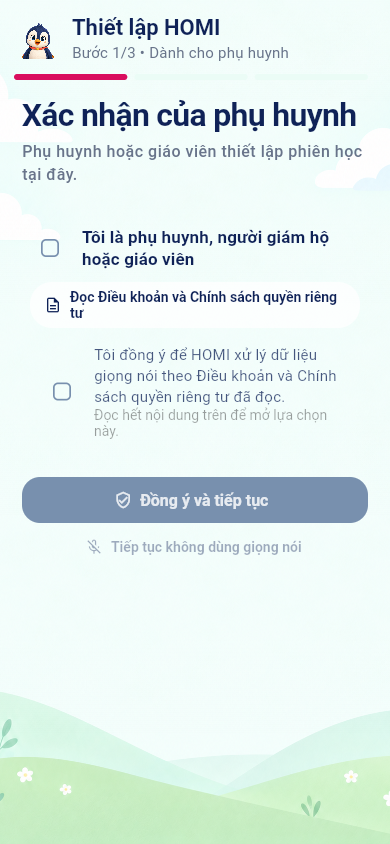
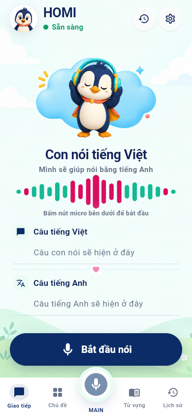
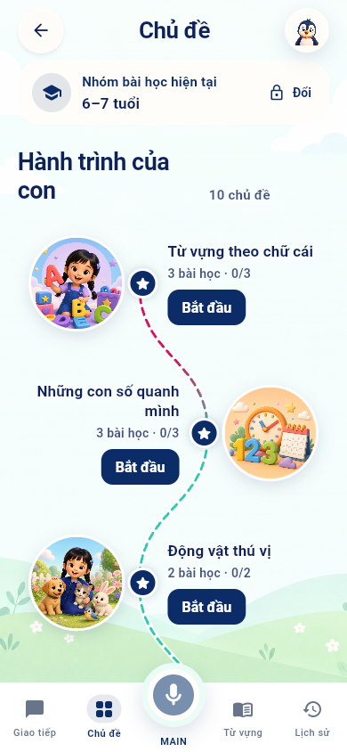
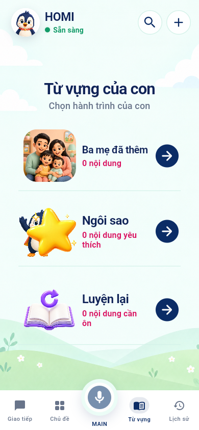
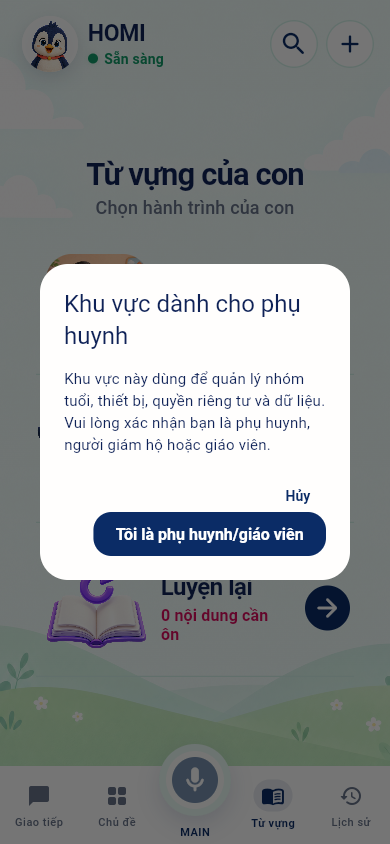
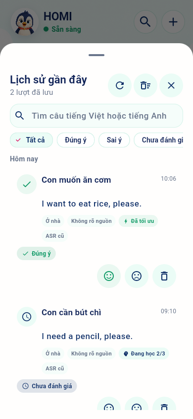
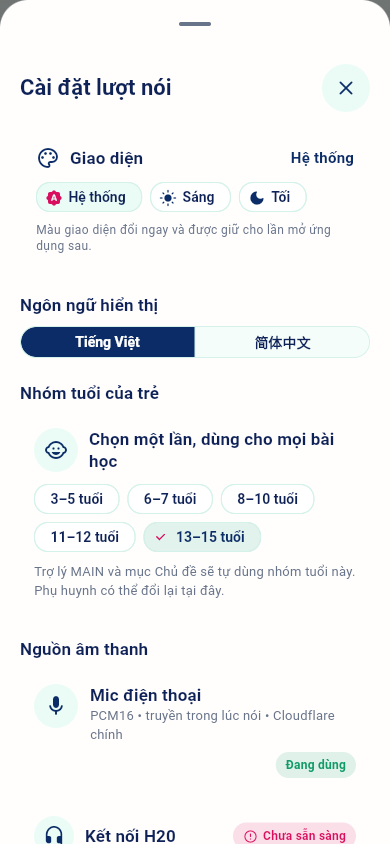
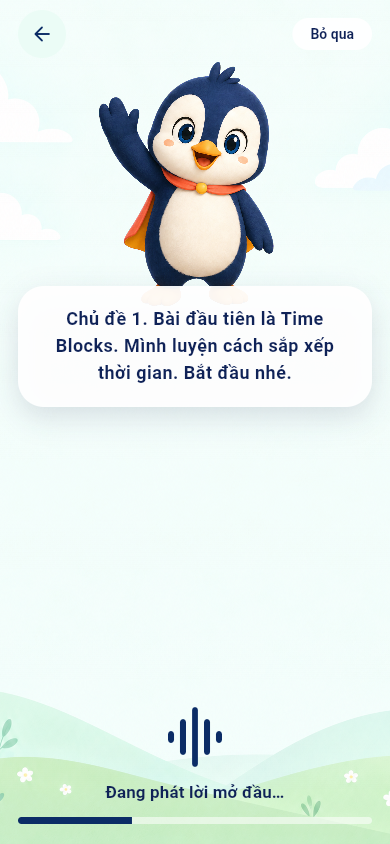
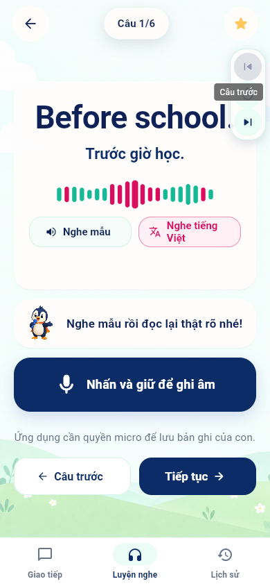
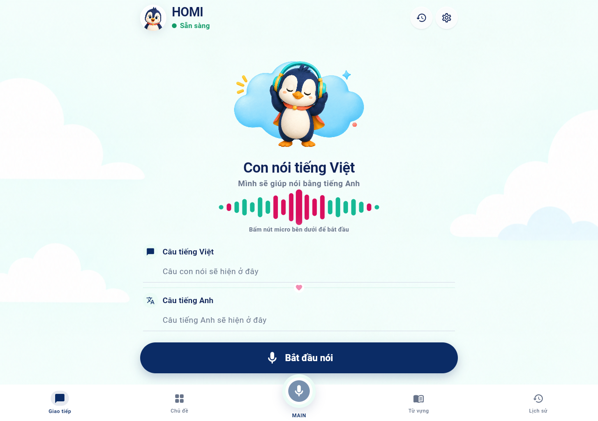

# Rà soát tổng quan UI/UX HOMI

Ngày đánh giá: 16/09/2026  
Phạm vi: onboarding phụ huynh, Giao tiếp, Chủ đề, Từ vựng, Lịch sử, Cài đặt, bài luyện nghe và bố cục web desktop.  
Thiết bị chụp: web 390 × 844 và 1280 × 900.  
Mục tiêu: tạo baseline trước khi nhận yêu cầu chỉnh UI; chưa sửa code sản phẩm.

## Kết luận nhanh

Giao diện hiện tại đã có một hệ nhận diện rõ và tương đối hoàn chỉnh: navy–mint–pink, mascot HOMI, bối cảnh thiên nhiên, card bo tròn và một thanh điều hướng thống nhất. So với audit cũ, vấn đề “tab dọc” và nút MAIN đè nội dung đã được xử lý.

Ba vấn đề nên ưu tiên trong vòng UI kế tiếp:

1. **Web desktop chưa có layout riêng.** Ở 1280 px, nội dung mobile vẫn nằm trong một cột hẹp ở giữa, trong khi thanh điều hướng giãn hết chiều ngang. Không lỗi, nhưng chưa tận dụng màn hình web.
2. **Hai hành động micro chưa rõ quan hệ.** Trang Giao tiếp có CTA “Bắt đầu nói” và nút MAIN ở giữa thanh dưới; cả hai dùng biểu tượng micro nhưng chưa giải thích rõ một nút dịch câu và một nút gọi trợ lý.
3. **Màn luyện nghe có điều hướng trùng.** Cụm nổi “Câu trước/Câu sau” bên phải xuất hiện cùng với hàng “Câu trước/Tiếp tục” ở dưới, làm tăng khả năng bấm nhầm và tranh vai trò với thanh điều hướng toàn app.

## Các bước đã rà

### 1. Onboarding — xác nhận phụ huynh

Tình trạng: **Khá tốt, cần tinh gọn phần pháp lý.**

- Đối tượng thao tác và tiến độ 1/3 rõ.
- Trình tự checkbox hợp lý với yêu cầu đồng ý dữ liệu giọng nói.
- Nút “Đọc Điều khoản…” hơi chật và xuống dòng vụn ở 390 px.
- Nội dung bị khóa dùng màu rất nhạt; cần kiểm tra tương phản thật trên Android/iOS, không chỉ ảnh web.

### 2. Trang Giao tiếp

Tình trạng: **Nền hình ảnh tốt, mô hình hành động cần làm rõ.**

- Mascot, tiêu đề và CTA có thứ bậc tốt; trạng thái “Sẵn sàng” nhìn thấy ngay.
- Card Việt/Anh dễ quét và có khoảng thở tốt.
- “Bắt đầu nói” và MAIN cùng dùng micro nhưng không nói rõ hai nhiệm vụ khác nhau.
- Lịch sử có cả lối tắt ở header và mục ở thanh dưới; có thể bỏ một lối nếu không có lý do sử dụng riêng.

### 3. Hành trình Chủ đề

Tình trạng: **Đẹp và dễ nhận biết, cần tinh chỉnh tiến độ.**

- Đường hành trình, ảnh chủ đề và trạng thái khóa phù hợp với trẻ nhỏ.
- Mỗi node đều có “Bắt đầu”; sau khi có dữ liệu học, nên ưu tiên một CTA “Học tiếp” cho node hiện tại và cho phép chạm toàn card ở các node khác.
- Tiến độ `0/3` có mặt nhưng chưa phải tín hiệu thị giác chính.

### 4. Trang Từ vựng

Tình trạng: **Rõ, ổn định và có thể mở rộng.**

- Ba hành trình có cùng cấu trúc nên dễ quét hơn phiên bản cũ.
- Empty state bằng số `0 nội dung` rõ nhưng chưa hướng người dùng đến hành động đầu tiên.
- Nút cộng ở header có thể được hỗ trợ thêm bằng CTA trong empty state, nhất là với phụ huynh mới.

### 5. Cổng xác nhận phụ huynh

Tình trạng: **Tốt.**

- Lý do bảo vệ khu vực được giải thích trước khi xác nhận.
- CTA chính rõ và không dùng ngôn ngữ kỹ thuật.
- Nên kiểm tra TalkBack/VoiceOver và thao tác quay lại thực tế; ảnh tĩnh chưa xác nhận focus trap.

### 6. Lịch sử gần đây

Tình trạng: **Nhiều chức năng tốt, hơi dày trên màn hình nhỏ.**

- Có tìm kiếm, lọc, trạng thái đánh giá, metadata và hành động trên từng lượt.
- Chip “Chưa đánh giá” bị cắt ở mép phải tại 390 px; nếu hàng này cuộn ngang thì cần tín hiệu cuộn, nếu không nên xuống dòng.
- Mỗi bản ghi có nhiều chip và ba nút hành động; nên ưu tiên thông tin chính, đưa metadata kỹ thuật vào phần mở rộng.

### 7. Cài đặt

Tình trạng: **Đầy đủ nhưng mật độ cao.**

- Theme, ngôn ngữ và nhóm tuổi nằm ở đầu là hợp lý.
- Thiết bị H20, HFP, nhận diện, lịch sử, quyền riêng tư và hướng dẫn cùng nằm trong một sheet dài; phụ huynh khó hình dung cấu trúc tổng thể.
- Nên tách thành các nhóm hoặc trang con: `Trẻ & nội dung`, `Thiết bị & âm thanh`, `Dữ liệu & quyền riêng tư`, `Giao diện & ngôn ngữ`.

### 8. Mở đầu bài học

Tình trạng: **Tập trung và thân thiện.**

- Chỉ có mascot, lời dẫn và trạng thái phát audio nên trẻ không bị phân tâm.
- Cần luôn có phương án tiếp tục khi audio lỗi hoặc tải quá lâu; ảnh này chỉ xác nhận trạng thái đang phát.

### 9. Luyện nghe và ghi âm

Tình trạng: **Hình ảnh tốt, điều hướng cần đơn giản hóa.**

- Câu tiếng Anh, nghĩa tiếng Việt, waveform và hai lựa chọn nghe có thứ bậc rõ.
- CTA ghi âm đủ lớn và cảnh báo quyền micro được đặt gần hành động.
- Cụm nổi bên phải và hai nút dưới cùng đang cùng điều khiển trước/sau; nên chỉ giữ một mô hình.
- Thanh toàn app vẫn xuất hiện trong lúc làm bài, có thể khiến trẻ vô tình rời bài. Cân nhắc chế độ tập trung, chỉ giữ thoát có xác nhận.

### 10. Trang Giao tiếp trên desktop

Tình trạng: **Hoạt động nhưng chưa phải layout web.**

- Nội dung chính có chiều rộng đọc tốt và không bị kéo méo.
- Hai bên có nhiều khoảng trống trang trí; thanh dưới giãn toàn màn hình làm các mục quá xa nhau.
- Hướng web phù hợp là shell giới hạn chiều rộng 960–1120 px, chuyển điều hướng thành rail/sidebar từ breakpoint tablet, và dùng cột phụ cho tiến độ/lịch sử gần đây khi có giá trị.

## Rủi ro accessibility quan sát được

- Cây accessibility hiện đọc lặp tên ở một số nút: `Giao tiếp Giao tiếp`, `Chủ đề Chủ đề`, `MAIN … MAIN`, `Nhấn và giữ để ghi âm … Nhấn và giữ để ghi âm`. Có thể đang đặt `Semantics.label` đồng thời giữ label con; nên loại trừ semantics trùng.
- Disabled text trong onboarding có nguy cơ tương phản thấp. Cần đo trực tiếp trên từng theme và thiết bị.
- Filter chip lịch sử bị cắt tại 390 px; zoom hoặc cỡ chữ lớn có thể làm nặng hơn.
- Điểm tốt: test hiện tại xác nhận luồng chính không overflow ở 200% text, màn hình nhỏ và reduced motion. Đây chưa phải chứng nhận WCAG/TalkBack/VoiceOver đầy đủ.

## Đối chiếu dự án mã nguồn mở

| Nguồn | Pattern đáng học | Áp dụng cho HOMI |
|---|---|---|
| [Mozilla Common Voice](https://github.com/common-voice/common-voice) | Một câu nói tại một thời điểm; ghi, bỏ qua, nghe lại và làm lại nằm trong cùng vòng lặp | Gom mỗi trạng thái giọng nói thành một hành động chính và cho trẻ đường hồi phục rõ khi nói sai/không nhận được tiếng |
| [OmniLingo](https://github.com/omnilingo/omnilingo) | Audio-first, bài ngắn theo lô 5 câu, độ khó tăng dần, phím tắt nhất quán | Giữ phiên học ngắn, hiển thị tiến độ rõ và hỗ trợ keyboard cho bản web |
| [LibreLingo](https://github.com/kantord/LibreLingo) | Bài tương tác, spaced repetition, lưu và đồng bộ tiến độ | Làm rõ `Học tiếp`, `Cần ôn`, `Đã hoàn thành`; không dùng cùng nhãn “Bắt đầu” cho mọi trạng thái |
| [FreeLingo](https://github.com/ArtCC/freelingo) | Một hệ thống gồm lộ trình, luyện nghe, phát âm, AI tutor và flashcard nhưng có cấu trúc module rõ | Giữ MAIN như một mode riêng, tránh để nó trông giống nút ghi âm của mode Giao tiếp |
| [Kolibri + Kolibri Design System](https://github.com/learningequality/kolibri-design-system) | Nhất quán, responsive, offline-first, accessibility; tránh ngắt quãng việc học và tránh card lồng card | Xây shell web thực sự, chuẩn hóa spacing/breakpoint và giảm lớp container trong sheet dài |
| [Scratch GUI](https://github.com/scratchfoundation/scratch-gui) | Trẻ em vẫn dùng được UI nhiều chức năng khi vùng làm việc chính và trạng thái đang chọn luôn rõ | Trong bài học, ưu tiên vùng học và ẩn điều hướng không liên quan thay vì giữ toàn bộ app shell |

## Hướng chỉnh đề xuất cho vòng kế tiếp

1. Chốt mô hình voice: `Giao tiếp` là dịch câu; `MAIN` là gọi trợ lý. Tách icon, label và trạng thái để không giống hai nút micro tương đương.
2. Thiết kế shell responsive theo ba mốc mobile, tablet và desktop; không chỉ kéo rộng nền mobile.
3. Đưa bài học vào focus mode: một thanh trên, một bộ trước/sau, một CTA ghi âm, thoát có xác nhận.
4. Tổ chức lại Cài đặt theo nhóm nhiệm vụ của phụ huynh; ẩn chẩn đoán kỹ thuật sau mục nâng cao.
5. Sửa semantics trùng và kiểm tra filter/history ở text scale 200% trên trình duyệt lẫn thiết bị thật.

## Kiểm chứng và giới hạn

- Đã chạy các golden test cho Home, onboarding, lesson flow và accessibility resilience: **19/19 test pass**.
- Ảnh web được chụp từ bản chạy hiện tại với demo backend và profile thử nghiệm riêng.
- Chưa kiểm tra TalkBack, VoiceOver, bàn phím đầy đủ, micro thật, H20/HFP, trạng thái mất mạng và hiệu năng animation trên thiết bị vật lý.
